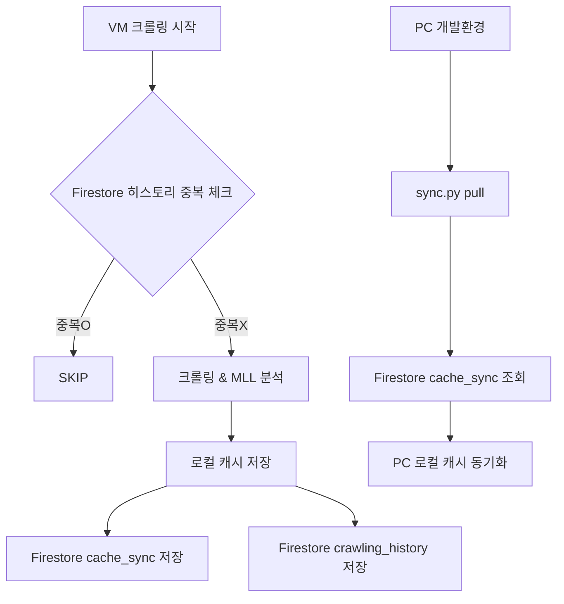

# 캐시 동기화 시스템 구현 계획 (2025-12-23 확정)

## 목표
VM과 PC 간 캐시 데이터를 Firestore를 통해 자동 동기화

---

## 핵심 결정사항: 3단계 자동 저장

| 단계 | 트리거 | Firestore 저장 내용 |
|:---|:---|:---|
| **1. 크롤링** | URL 추출 완료 | 캐시 데이터 + 히스토리 |
| **2. LLM 분석** | 분석 결과 수신 | 분석 결과 업데이트 |
| **3. 발행** | 발행 완료 | 발행 정보 업데이트 |
| (분류/검토) | 수동 작업 | 저장 안 함 |

> **비용**: 일 100건 이내 = 무료 범위

---

## Firestore 구조

```
Firestore
├── articles/              ← 기존 (발행된 기사, Web 조회용)
├── publications/          ← 기존 (회차 정보)
│
├── crawling_history/      ← 신규 (중복 방지용)
│   └── {url_hash}: {
│         status: "ACCEPTED" | "WORTHLESS" | ...,
│         reason: "high_score" | "manual_correction" | ...,
│         timestamp: "2025-12-23T..."
│       }
│
└── cache_sync/            ← 신규 (캐시 데이터 백업용)
    └── {date}/            ← 서브컬렉션 (예: 2025-12-23)
        └── {article_id}: {
              ...전체 캐시 데이터...
            }
```

---

## 수정 필요 파일 및 구현 상세

### 1. `desk/src/core_logic.py`
- **`save_to_cache()` 수정**: 
  - `sync_firestore=True` 옵션 추가 (기본값 False 또는 상황에 따라 True)
  - 로컬 저장 후 Firestore `upload_cache` 호출

### 2. `desk/src/db_client.py`
**신규 메서드 추가**:
- `upload_cache(url, content)`: 
  - `cache_sync/{date}/{article_id}` 경로에 저장
- `download_cache_by_date(date_str)`: 
  - `cache_sync/{date_str}` 컬렉션 전체 조회 후 로컬 저장
- `check_history_firestore(url)`: 
  - `crawling_history` 컬렉션 조회 (1 read)
- `save_history_firestore(url, status, reason)`: 
  - `crawling_history` 컬렉션 저장 (1 write)

### 3. `desk/src/routes/crawler.py`
- 크롤링 완료 핸들러에서 `save_to_cache(..., sync_firestore=True)` 호출

### 4. `desk/src/routes/batch.py`
- LLM 분석 결과 수신 핸들러에서 `update_cache` 시 Firestore 동기화 수행

### 5. `desk/scripts/sync.py` (신규 파일)
수동 동기화 및 관리용 CLI 도구:
```python
# 사용법 예시
python sync.py pull --date 2025-12-23   # Firestore → 로컬 (동기화)
python sync.py push --date 2025-12-23   # 로컬 → Firestore (강제 업로드)
python sync.py status                   # 동기화 상태 요약 확인
```

---

## 데이터 흐름



---

## 비용 분석 (일일 기준)

| 작업 | 예상 빈도 | 무료 한도 대비 |
|:---|:---|:---|
| 크롤링 저장 (write) | 50건 | 0.25% |
| LLM 분석 업데이트 (write) | 50건 | 0.25% |
| 발행 업데이트 (write) | 10건 | 0.05% |
| 히스토리 체크 (read) | 100건 | 0.2% |
| **합계** | ~210건 | **~1% (안전)** ✅ |
