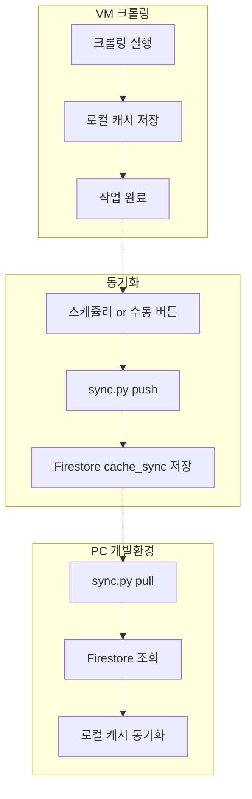

# 캐시 동기화 시스템 구현 계획 (2025-12-24 개정)

## 목표
VM과 PC 간 캐시 데이터를 **스케쥴링 + 수동 트리거** 방식으로 동기화

> **변경 이유**: 기존 이벤트 기반 자동 동기화 방식 대비 코드 복잡도 감소, 관심사 분리 원칙 유지

---

## 동기화 대상

| 데이터 | 경로 | 설명 |
|:---|:---|:---|
| **캐시 파일** | `desk/cache/{날짜}/*.json` | 모든 캐시 (상태 무관) |
| **크롤링 히스토리** | `desk/data/crawling_history.json` | 중복 방지용 URL 처리 기록 |

---

## 비용 최적화 전략

| 방식 | READ 비용 | 설명 |
|:---|:---|:---|
| ~~Firestore 조회로 동기화 여부 확인~~ | ❌ 비용 발생 | 매번 목록 조회 |
| **로컬 `synced_at` 필드로 판단** | ✅ 비용 0 | 캐시 파일에 마킹 |

> **핵심**: push 시 Firestore 조회 없이 로컬 `synced_at` 필드만 확인하여 비용 절감

---

## 핵심 결정사항: 배치 동기화

| 구분 | 내용 |
|:---|:---|
| **방식** | 정해진 시간에 스케쥴링 동기화 + 수동 버튼 업데이트 |
| **트리거** | 1) 크론잡 (예: 매일 06:00, 18:00) 2) 수동 버튼 클릭 |
| **저장 단위** | 일괄 배치 (개별 이벤트마다 저장 안 함) |
| **장점** | 기존 로직 수정 불필요, 단일 진입점, 유지보수 용이 |

> **비용**: 일 2~3회 배치 = 무료 범위 내 안전

---

## Firestore 구조 (변경 없음)

```
Firestore
├── articles/              ← 발행된 기사 (Web 조회용)
├── publications/          ← 회차 정보
│
├── crawling_history/      ← 중복 방지용
│   └── {url_hash}: {
│         status: "ACCEPTED" | "WORTHLESS" | ...,
│         reason: "high_score" | "manual_correction" | ...,
│         timestamp: "2025-12-23T..."
│       }
│
└── cache_sync/            ← 캐시 데이터 백업용
    └── {date}/            ← 서브컬렉션 (예: 2025-12-24)
        └── {article_id}: {
              ...전체 캐시 데이터...
            }
```

---

## 구현 파일

### 1. `desk/scripts/sync.py` (신규)

**메인 동기화 CLI 도구**:
```python
# 사용법
python sync.py push [--date YYYY-MM-DD]  # 로컬 캐시 → Firestore
python sync.py pull [--date YYYY-MM-DD]  # Firestore → 로컬 캐시
python sync.py status                     # 동기화 상태 요약
```

**주요 기능**:
- `push`: 지정 날짜(기본: 오늘)의 로컬 캐시 파일을 Firestore에 일괄 업로드
- `pull`: Firestore에서 지정 날짜의 캐시를 로컬로 다운로드
- `status`: 로컬 vs Firestore 캐시 개수 비교, 마지막 동기화 시간 표시

### 2. `desk/src/db_client.py` (메서드 추가)

| 메서드 | 설명 |
|:---|:---|
| `upload_cache_batch(date_str, cache_list)` | 캐시 리스트를 `cache_sync/{date}` 컬렉션에 일괄 저장 |
| `download_cache_batch(date_str)` | `cache_sync/{date}` 컬렉션 전체 조회 후 반환 |
| `get_sync_status()` | 동기화 메타데이터 조회 (마지막 동기화 시간 등) |
| `update_sync_status(sync_info)` | 동기화 메타데이터 업데이트 |

### 3. `desk/src/routes/desk.py` (선택)

Desk UI에서 호출할 수 있는 API 엔드포인트:
```python
@desk_bp.route('/api/desk/sync', methods=['POST'])
def sync_cache():
    # direction: 'push' | 'pull'
    # date: 'YYYY-MM-DD' (optional)
    pass
```

---

## 데이터 흐름



---

## 스케쥴링 설정 (선택)

### Windows Task Scheduler (PC)
```powershell
# 매일 06:00 pull 실행
schtasks /create /tn "ZND Cache Sync" /tr "python C:\Users\saint\ZND\desk\scripts\sync.py pull" /sc daily /st 06:00
```

### Linux Cron (VM)
```bash
# 매일 06:00, 18:00 push 실행
0 6,18 * * * cd /path/to/ZND && python desk/scripts/sync.py push
```

---

## 비용 분석 (일일 기준)

| 작업 | 예상 빈도 | 무료 한도 대비 |
|:---|:---|:---|
| 배치 push (write) | 2회 × 50건 | 0.5% |
| 배치 pull (read) | 2회 × 50건 | 0.2% |
| 상태 조회 (read) | 5회 | 0.01% |
| **합계** | ~210건 | **~1% (안전)** ✅ |

---

## 마이그레이션 가이드

### 기존 계획 대비 제거된 항목
- ❌ `save_to_cache()`의 `sync_firestore=True` 옵션 (불필요)
- ❌ 각 라우트에서 개별 Firestore 호출 (불필요)
- ❌ 크롤링/분석/발행 시점별 자동 저장 (배치로 대체)

### 유지되는 항목
- ✅ `crawling_history/` 컬렉션 구조
- ✅ `cache_sync/` 컬렉션 구조
- ✅ 히스토리 기반 중복 방지
